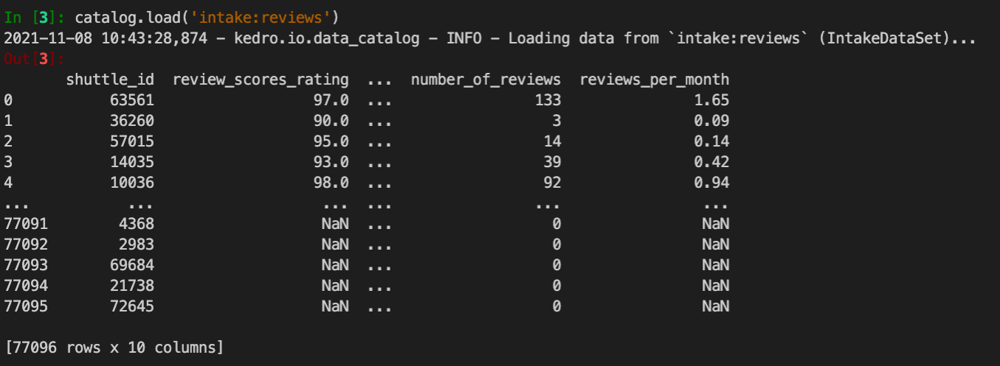

# Prototype integration of the Intake catalog within Kedro

The [Intake](https://intake.readthedocs.io/) catalog is similar to the Kedro `DataCatalog` and this repository serves as a testing ground for considering ways for the two tools to work together and provide users with a greater breadth of functionality. Eventually this repository could serve as a basis for a full fledged Kedro plugin.

### Intake Catalog

```yaml
metadata:
  version: 1

sources:
  reviews:
    args:
      urlpath: data/01_raw/reviews.csv
    driver: csv
    description: "A log of company reviews"
```

### After catalog created hook

```python
from space.extras.datasets.intake_dataset import IntakeDataSet

@hook_impl
def after_catalog_created(self, catalog: DataCatalog):

    # Could extend to make path glob pattern or be user configurable
    intake_catalog = intake.open_catalog("conf/base/intake.yml")
    intake_datasets = {
        x: IntakeDataSet(intake_catalog=intake_catalog, dataset_name=x)
        for x in list(intake_catalog)
    }

    # Add discovered datasets to Kedro catalog and prefix entries 
    for ds_name, ds_obj in intake_datasets.items():
        catalog.add(
            data_set_name=f"intake:{ds_name}", data_set=ds_obj, replace=True
        )
    
```

### Define `IntakeDataSet`

- Implementation can be found at: `extras/datasets/intake_dataset.py`
- Simple wrapper for Intake catalog object providing load functionality, save `raise`s an error

## Results



## Why do this?

The intake catalog supports a [wide range of plugins](https://intake.readthedocs.io/en/latest/plugin-directory.html) and dataset targets that would give users a wider range of readable sources out of the box. Kedro takes quite a low level approach to the type of datasets supported so providing users with complex high level connectors such as:

- [Mongo](https://github.com/intake/intake-mongo)
- [Metabase](https://github.com/continuumio/intake-metabase)
- [Stripe](https://github.com/sophiamyang/intake-stripe)
- [Solr](https://github.com/intake/intake-solr)
- [Salesforce](https://github.com/sophiamyang/intake-salesforce)
- [Splunk](https://github.com/intake/intake-splunk) 
